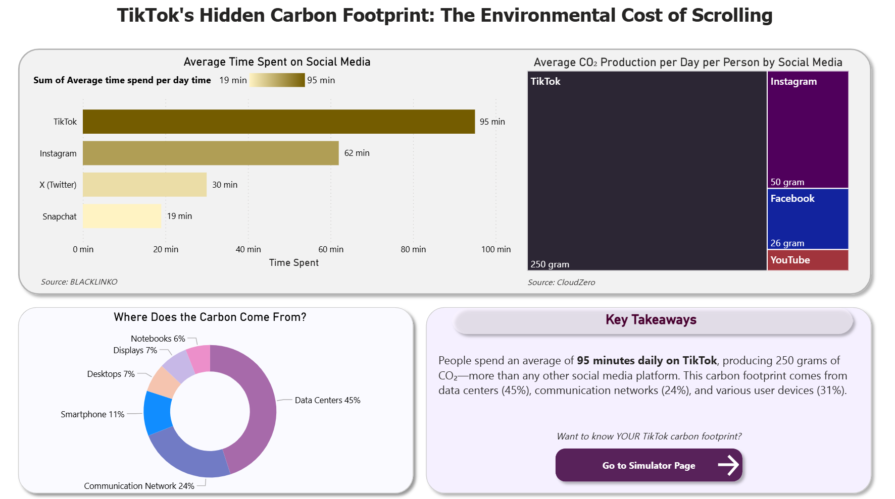
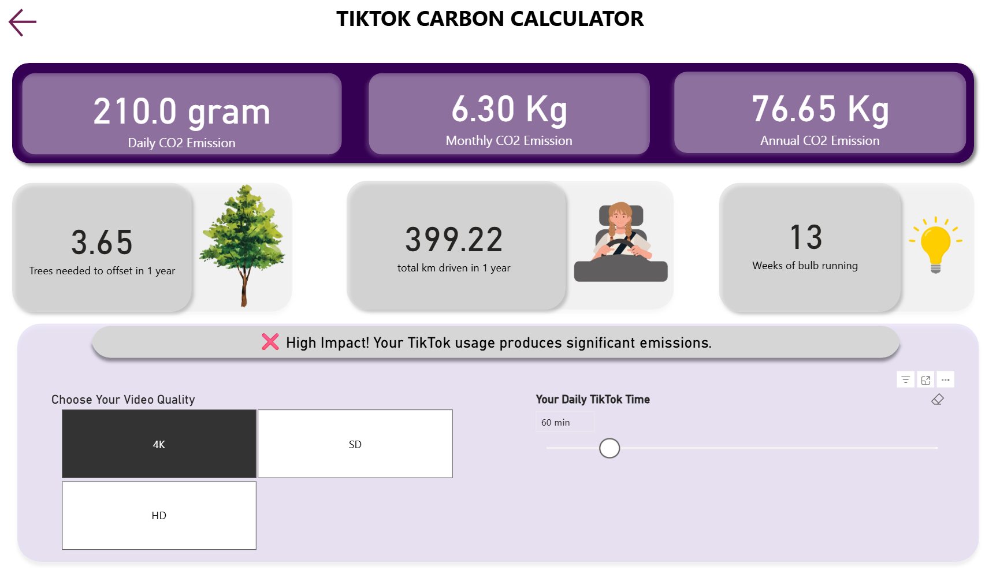

# 🌱 TikTok Carbon Footprint Calculator


An interactive Power BI dashboard that calculates and visualizes the carbon footprint of TikTok usage, raising awareness about digital sustainability among users worldwide.

## 📋 Table of Contents
- [Overview](#overview)
- [Features](#features)
- [Demo](#demo)
- [Installation](#installation)
- [Usage](#usage)
- [Data Sources](#data-sources)
- [Project Structure](#project-structure)
- [Key Insights](#key-insights)
- [Contributing](#contributing)
- [License](#license)
- [Contact](#contact)

## 🌍 Overview

This project is part of the **Green Digital Certificate Capstone** by Universiti Malaysia Pahang Al-Sultan Abdullah. It addresses the invisible environmental impact of social media usage, specifically TikTok, by creating an interactive simulator that helps people understand and reduce their digital carbon footprint.

### The Problem
People spend an average of **95 minutes daily** on TikTok, generating **250 grams of CO₂** per day—yet most are unaware of this hidden environmental impact.

### The Solution
A two-page Power BI dashboard that:
1. **Awareness Page**: Displays compelling statistics and comparisons about TikTok's carbon footprint
2. **Simulator Page**: Allows users to calculate their personal emissions and explore "what-if" scenarios

## ✨ Features

### 📊 Awareness Page
- **Social Media Time Comparison**: Visual breakdown of average daily usage across platforms
- **CO₂ Emissions by Platform**: Shows TikTok produces the highest daily emissions (250g)
- **Emission Sources Breakdown**: Pie chart showing data centers (45%), networks (24%), and devices (31%)
- **Educational Statistics**: Contextualizes digital carbon footprint

### 🧮 Interactive Simulator
- **Dynamic Inputs**:
  - Screen time slider (15-300 minutes/day)
  - Video quality selector (SD/HD/4K)
  
- **Real-time Calculations**:
  - Daily, monthly, and annual CO₂ emissions
  - Equivalent comparisons:
    - 🚗 Kilometers driven
    - 🌳 Trees needed to offset
    - 📱 Smartphones charged
    - 💡 Days of light bulb use

- **What-If Scenarios**:
  - Reduce screen time by 30 minutes
  - Switch from HD to SD quality
  - Combined savings potential

- **Performance Rating**: Dynamic feedback on user's digital habits with actionable tips

- **Green Tips**: Practical recommendations to reduce carbon footprint

## 🎬 Demo

### Awareness Page

*Shows TikTok's environmental impact through compelling data visualizations*

### Simulator Page

*Interactive calculator with real-time emissions and comparisons*

## 🚀 Installation

### Prerequisites
- Microsoft Power BI Desktop (Latest version)
- Windows 10 or later / macOS with Power BI compatibility

### Steps

1. **Clone the repository**
```bash
git clone https://github.com/RS-cloud14/Power-BI--Tiktok-Simulator.git
cd Power-BI--Tiktok-Simulator
```

2. **Download the Power BI file**
   - Download `TikTok_Carbon_Calculator.pbix` from the repository

3. **Open in Power BI Desktop**
   - Double-click the `.pbix` file or
   - Open Power BI Desktop → File → Open → Select the file

4. **Start exploring!**
   - Navigate between Awareness and Simulator pages
   - Adjust sliders to see real-time calculations

## 💡 Usage

### For General Users
1. Open the dashboard
2. Go to the **Simulator Page**
3. Input your daily TikTok screen time
4. Select your usual video quality (SD/HD/4K)
5. Review your carbon footprint and comparisons
6. Check the performance rating and green tips
7. Explore "what-if" scenarios to see potential savings

### For Educators
- Use the Awareness Page to introduce digital sustainability concepts
- Facilitate discussions about invisible environmental impacts
- Encourage people to calculate and share their results
- Integrate into environmental science or digital literacy courses

### For Researchers
- Adapt the methodology for other social media platforms
- Use emission data for comparative studies
- Extend calculations to organizational or community levels

## 📊 Data Sources

### Emission Factors
| Platform | CO₂ per Minute (grams) | Source |
|----------|------------------------|--------|
| TikTok | 2.63 | CloudZero Research |
| Instagram | 1.50 | CloudZero Research |
| Facebook | 0.79 | CloudZero Research |
| YouTube | 0.46 | CloudZero Research |

### Usage Statistics
- Average daily TikTok usage: 95 minutes ([BLACKLINKO](https://backlinko.com/tiktok-users))
- Global TikTok users: 1.58 billion
- Average social media time by platform: Multiple industry reports

### Emission Source Breakdown
- Data Centers: 45%
- Communication Networks: 24%
- User Devices: 31% (Smartphones, Desktops, Displays, Notebooks)

*Source: Digital Carbon Footprint Research 2024*

## 📁 Project Structure

```
Power-BI--Tiktok-Simulator/
│
├── TikTok_Carbon_Calculator.pbix    # Main Power BI dashboard
├── data/
│   ├── quality_table.csv            # Video quality emission rates
│   ├── social_media_stats.csv       # Platform usage statistics
│   └── emission_sources.csv         # Carbon source breakdown
│
├── screenshots/
│   ├── awareness-page.png
│   └── simulator-page.png
│
├── docs/
│   ├── DAX_Formulas.md              # Complete DAX code reference
│   ├── Implementation_Guide.md      # Step-by-step setup instructions
│   └── Survey_Questions.pdf         # User feedback survey template
│
├── README.md                         # This file
├── LICENSE                           # MIT License
└── CONTRIBUTING.md                   # Contribution guidelines
```

## 🔑 Key Insights

### Carbon Impact Examples
- **95 minutes of TikTok daily** = 91.2 kg CO₂/year = Driving 475 km
- **Switching from HD to SD** = Save up to 60% emissions
- **Reducing 30 min/day** = Save 28.7 kg CO₂/year = 1.4 trees worth of offset

### Awareness Goals
✅ Target: 65% of users report increased awareness  
✅ Encourage behavior change through interactive visualization  
✅ Provide actionable, practical tips for greener digital habits

## 🤝 Contributing

Contributions are welcome! Here's how you can help:

### Ways to Contribute
- 🐛 Report bugs or issues
- 💡 Suggest new features or improvements
- 📊 Add data for other social media platforms
- 🌍 Translate to other languages
- 📝 Improve documentation

### Contribution Process
1. Fork the repository
2. Create a feature branch (`git checkout -b feature/AmazingFeature`)
3. Commit your changes (`git commit -m 'Add some AmazingFeature'`)
4. Push to the branch (`git push origin feature/AmazingFeature`)
5. Open a Pull Request

See [CONTRIBUTING.md](CONTRIBUTING.md) for detailed guidelines.

## 📈 Roadmap

- [ ] Add more social media platforms (YouTube, Snapchat, X)
- [ ] Mobile-responsive version
- [ ] Multi-language support (Malay, Chinese)
- [ ] Export personal report feature
- [ ] Integration with screen time tracking apps
- [ ] Gamification elements (badges, challenges)
- [ ] Group/organization tracking dashboard

## 📄 License

This project is licensed under the MIT License - see the [LICENSE](LICENSE) file for details.

## 👤 Contact

**Tham Ren Sheng**  
Universiti Malaysia Pahang Al-Sultan Abdullah

- GitHub: [@RS-cloud14](https://github.com/RS-cloud14)
- LinkedIn: [Ren Sheng Tham](https://www.linkedin.com/in/ren-sheng-tham-245649258)
- Email: renshengtham@gmail.com

**Project Link**: [https://github.com/RS-cloud14/Power-BI--Tiktok-Simulator](https://github.com/RS-cloud14/Power-BI--Tiktok-Simulator)

## 🙏 Acknowledgments

- **INCO Group** - Green Digital Certificate Program
- **CloudZero** - Emission data research
- **BLACKLINKO** - Social media usage statistics

---

## 📱 Share Your Results

Completed the dashboard? Share your results on social media!

**Tag**: `#GreenDigitalCertificate` `#DigitalSustainability` `#TikTokCarbon` `@incogroup`

---

<div align="center">

**Made with 💚 for a greener digital future**

⭐ Star this repository if you found it helpful!

</div>
